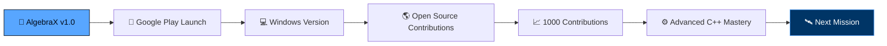

<div align="center">


# 🚀 MISSION CONTROL

### *Exploring Engineering • Building Software • Solving Problems*


<br/>


<br/><br/>

**[📡 Transmission Log](#-transmission-log)** • 
**[🚀 Active Mission](#-current-mission)** • 
**[🌌 Tech Stack](#-technology-constellation)** • 
**[📡 Telemetry](#-telemetry)** • 
**[📅 Flight Plan](#-flight-plan)** • 
**[📫 Contact](#-contact-mission-control)**

</div>

<br/>

---

<br/>

# 📡 Transmission Log

> **INCOMING SIGNAL** — *decoded from low earth orbit*

```
> transmission_status: RECEIVING
> origin: BANGLADESH 🇧🇩
> operator: MEHEDI HASAN
> callsign: ALGEBRAX
> mission_clock: RUNNING
> fuel_reserve: ☕☕☕☕☕ (FULL)
```

I'm a **Computer Science student** and **Flutter developer** who treats every
build like a launch sequence — plan the trajectory, write the code, run
the checks, and send it. My focus right now is **offline-first engineering
software**: tools that work in a hostel room with no signal just as well
as they do on a full-bar campus network.

I'm not chasing a hundred half-finished repos. I'm chasing **one platform,
built right** — and that platform is **AlgebraX**.

<br/>

---

<br/>

# 🛰 Mission Brief

```yaml
Name: Mehedi Hasan
Call Sign: AlgebraX
Status: Active
Clearance Level: Root Access

Mission:
  Building fast, modern engineering software
  for students and professionals — the kind
  of tool I wished existed when I was the
  one cramming for an exam with six different
  broken calculator apps open.

Base: Bangladesh 🇧🇩

Specialization:
  - Flutter & Dart
  - C++ (Systems + Computation)
  - Engineering Mathematics
  - Scientific Computing
  - Offline-First Architecture
  - SQLite & Local-Data Design

Current Project:
  AlgebraX Engineering Suite

Mission Duration: ONGOING
Abort Conditions: NONE
```

<br/>

---

<br/>

# 🚀 Current Mission

<div align="center">

## ⚡ AlgebraX Engineering Suite

### *One app. Every tool. Zero internet required.*

</div>

Most engineering students don't need twelve separate apps — a scientific
calculator here, a graphing tool there, a matrix solver buried in a browser
tab that dies the second the wifi does. **AlgebraX exists to replace all of
that with one offline-first suite** that just works, everywhere, every time.

<br/>

### 🎯 Mission Modules

<div align="center">

| Module | Function |
|:---:|:---|
| 🧮 | **Scientific Calculator** — full-precision computation, zero lag |
| 📈 | **Graph Plotter** — visualize functions in real time |
| 📐 | **Matrix Calculator** — linear algebra without the headache |
| 📊 | **Statistics Engine** — data analysis on the go |
| ⚡ | **Equation Solver** — from linear to nonlinear systems |
| 📚 | **Formula Library** — every formula, one search away |
| 🔌 | **Electrical Engineering Tools** — circuit-ready calculations |
| 🛰 | **Electronics Calculator** — component & signal math |
| 💻 | **Programming Utilities** — base conversion, bitwise ops, more |
| 📏 | **Unit Converter** — every unit, every system |
| 🌙 | **Modern Dark UI** — built for late-night study sessions |

</div>

<br/>

```text
> BUILD_PHILOSOPHY
  ────────────────────────────────
  ✔ Offline-first  → works with zero signal
  ✔ Fast           → no loading spinners on core tools
  ✔ Unified        → one app, not twelve
  ✔ Local          → your data stays on your device
  ✔ Practical      → built by a student, for students
```

<br/>

---

<br/>

# 🌌 Technology Constellation

<p align="center">

</p>

<br/>

<div align="center">

**Core Language**
<br/>


**Framework & Platform**
<br/>


**Data & Infrastructure**
<br/>


**Tooling**
<br/>


</div>

<br/>

---

<br/>

---

<br/>

# 🇵🇸 Palestine

<p align="center">
  
</p>

<p align="center">
  <b>Free Palestine 🇵🇸</b>
</p>

<br/>

---

# 📊 Orbital Activity

<p align="center">

</p>

<br/>

---

<br/>


---

<br/>

# 🛰 Spacecraft Systems

<div align="center">

| System | Status | Notes |
|:---:|:---:|:---|
| Flutter | 🟢 Operational | Primary build system |
| Dart | 🟢 Operational | Core language |
| C++ | 🟢 Operational | Performance-critical modules |
| SQLite | 🟢 Operational | Local data layer |
| Git | 🟢 Operational | Version control |
| GitHub | 🟢 Operational | Mission archive |
| Firebase | 🟡 Standby | Reserved for future sync features |
| Coffee Reserves | 🟢 Operational | Never below 80% |

</div>

<br/>

---

<br/>

# 🌍 Current Orbit

```text
Orbit        : Low Earth Orbit
Velocity     : 7.66 km/s
Fuel         : Coffee ☕
Power        : 100%
Signal       : Strong
Status       : Coding...
Next Burn    : AlgebraX v1.0 Release
```

<br/>

---

<br/>

# 🧭 Engineering Log

> *A running record of lessons learned in orbit.*

```diff
+ [LOG 001] Offline-first isn't a feature — it's a promise.
+ [LOG 002] A student debugging at 2 AM shouldn't need wifi to check a formula.
+ [LOG 003] One well-built tool beats ten half-built ones. Every time.
+ [LOG 004] C++ taught me to respect memory. Flutter taught me to respect UI.
+ [LOG 005] The best calculator app is the one you forget you're using.
```

<br/>

---

<br/>

# 📅 Flight Plan

<div align="center">



</div>

- 🚀 **Release AlgebraX v1.0** — the full engineering suite, launch-ready
- 📱 **Publish on Google Play** — get it into student hands worldwide
- 💻 **Build Windows Version** — desktop parity with mobile
- 🌎 **Contribute to Open Source** — give back to the tools I build on
- 📈 **Reach 1000 Contributions** — consistency is the mission
- ⚙️ **Master Advanced C++** — go deeper into systems-level engineering

<br/>

---

<br/>

# 🧠 Mission Philosophy

<div align="center">

> ### *"Engineering is exploration.*
> ### *Every solved problem is another step into the unknown."*

</div>

<br/>

I don't build software to fill a portfolio. I build it because there's a
gap I can see clearly — a student with six broken tabs open, a formula
that's one search away from being lost, an app that stops working the
second the signal drops. **AlgebraX is my answer to that gap.**

Every module in this suite exists because I needed it first.

<br/>

---

<br/>

# 🌠 Signal From Deep Space

<p align="center">

</p>

<br/>

---

<br/>

# 🧪 Mission Stats At A Glance

<div align="center">

```text
┌─────────────────────────────────────────────┐
│   MISSION DESIGNATION  : AlgebraX            │
│   MISSION TYPE         : Engineering Suite   │
│   PLATFORM             : Flutter / Dart      │
│   ARCHITECTURE         : Offline-First       │
│   MODULES ACTIVE       : 11                  │
│   LAUNCH READINESS     : IN PROGRESS         │
│   OPERATOR CLEARANCE   : FULL                │
└─────────────────────────────────────────────┘
```

</div>

<br/>

---

<br/>

# 🐍 Cosmic Trail

<p align="center">

</p>

<sub>*If this section appears blank, the Snake GitHub Action needs to be enabled once in repo settings — after that it updates itself automatically.*</sub>

<br/>

---

<br/>

# 📫 Contact Mission Control

<div align="center">

**Open a channel. All frequencies monitored.**

<br/>

<a href="https://github.com/iamehedi">

</a>
<a href="mailto:iamehedihsn@gmail.com">

</a>
<a href="https://www.linkedin.com/in/mehedi-hasan-97583a392/">

</a>

</div>

<br/>

---

<br/>

<div align="center">

## 🌌 END OF TRANSMISSION

### *"Keep exploring. Keep building."*

<br/>

**— Mehedi Hasan, Call Sign Zyntrix Studio**


</div>
